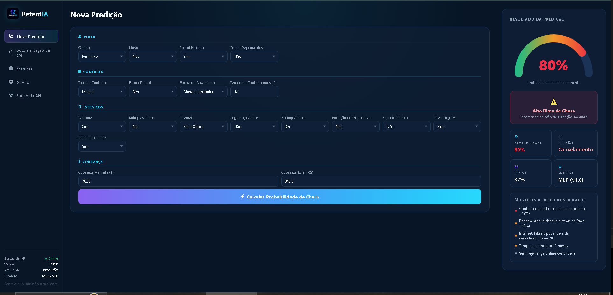
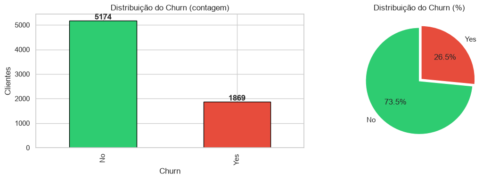
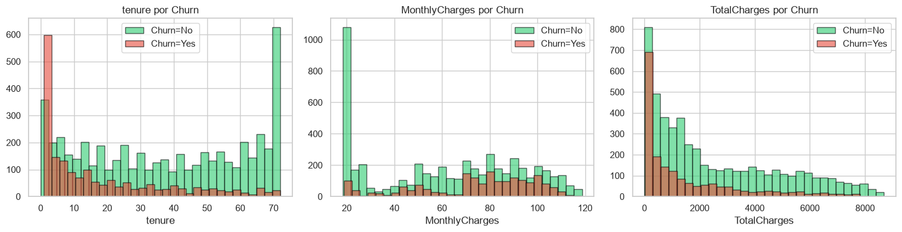
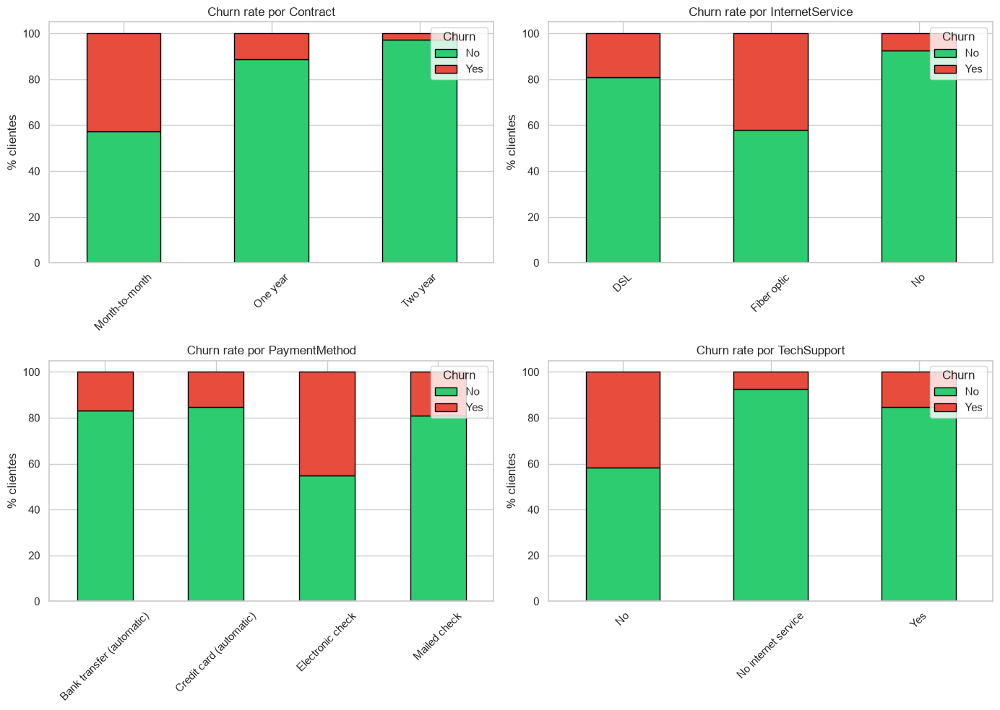
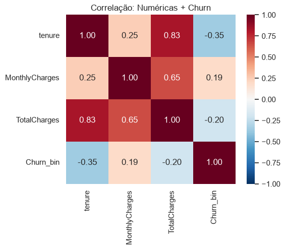
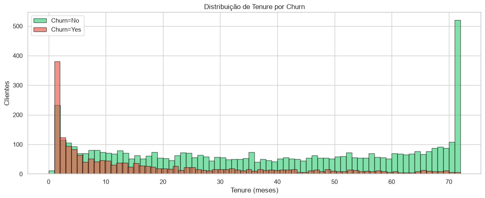
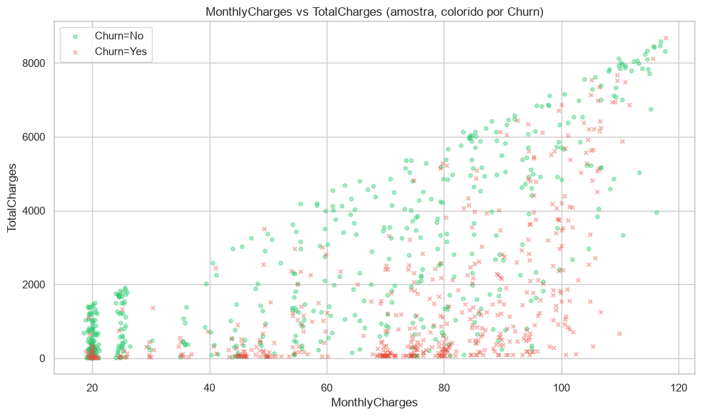
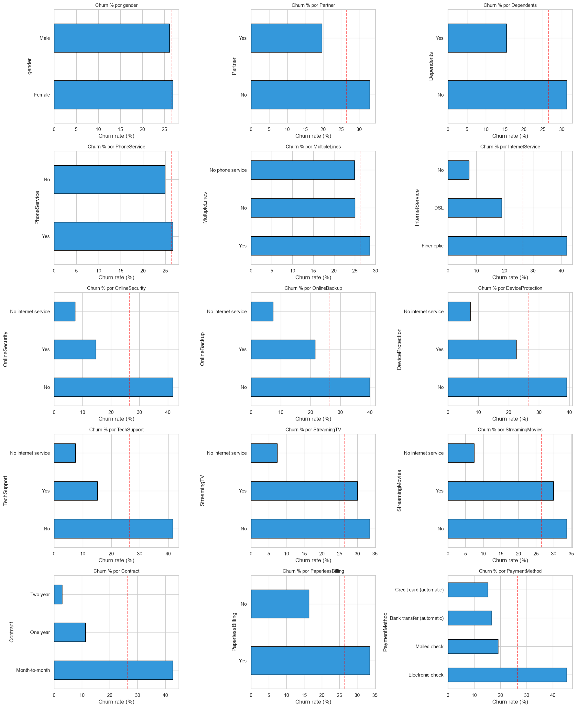

<p align="center">
  
</p>

<h1 align="center">RetentIA</h1>

<p align="center">
  <a href="https://github.com/vdfs89/RetentIA/actions/workflows/ci.yml"></a>
  <a href="https://www.python.org/downloads/release/python-3110/"></a>
  <a href="https://fastapi.tiangolo.com"></a>
  <a href="https://pytorch.org"></a>
</p>

<p align="center">
  <em>Predict customer churn before it happens.</em>
</p>

<p align="center">
  Projeto de predição de churn com MLP (PyTorch), FastAPI, MLflow e práticas de MLOps.<br>
  <strong>FIAP Pós-Tech MLET — Tech Challenge.</strong>
</p>

<p align="center">
  🔗 <strong>API pública:</strong> <a href="http://retentia.vitorsilva.engineer/docs">retentia.vitorsilva.engineer</a>
</p>

---

## Resultados

| Modelo         | Accuracy | Precision | Recall   | F1     | ROC-AUC | PR-AUC |
|----------------|----------|-----------|----------|--------|---------|--------|
| Dummy          | 0.7346   | 0.0000    | 0.0000   | 0.0000 | 0.5000  | 0.2654 |
| LogReg @0.5    | 0.7381   | 0.5043    | 0.7807   | 0.6128 | 0.8429  | 0.6340 |
| XGBoost @0.5   | 0.7480   | 0.5167    | 0.7861   | **0.6236** | 0.8420 | **0.6534** |
| **MLP @0.37**  | 0.6828   | 0.4510    | **0.8984** | 0.6005 | **0.8453** | 0.6372 |

**Cost-optimized threshold: 0.37** (tuned on validation set, C_FN=500, C_FP=100).

ROC-AUC é quase idêntico nos três modelos (~0.842–0.845) — o sinal vem das features, não da arquitetura. O XGBoost lidera em F1 e PR-AUC @0.5. O MLP captura **90% dos churners reais** operando no threshold por custo. Análise honesta: o MLP não supera o XGBoost em F1 — a contribuição é o **framework de threshold sensível a custo**. Ver [MODEL_CARD](docs/MODEL_CARD.md).

---

## Interface

<p align="center">
  
</p>

🔗 **Live:** [retentia.vitorsilva.engineer](http://retentia.vitorsilva.engineer)

---

## Quickstart

```bash
# Instalar dependências
make install                  # ou: uv pip install --system -r requirements.txt

# Treinar (baixa o dataset automaticamente no primeiro run)
make train                    # baselines + MLP + threshold por custo → models/

# Testes (isolados — não tocam os modelos treinados)
make test                     # 8 testes: health, metrics, predict, model, schema

# Subir a API local
make run                      # http://localhost:8000/docs

# Inferência em batch
make run-batch                # → data/processed/batch_output.jsonl

# Lint
make lint                     # ruff check + format check
```

---

## Arquitetura

Segue a convenção do projeto de referência [`swe4ds-credit-api`](https://github.com/Cataldir/Materiais-MLET) (Pós-Tech MLET, Fase 01 — Eng. de Software para Cientistas de Dados).

```
src/
  main.py                     # FastAPI thin (routers + middleware de latência)
  routes/
    metrics.py                # /health + /metrics (Prometheus)
    predict.py                # /predict → services
  services/
    model_service.py          # load_model, predict_one, drift log
  api/
    schemas.py                # Pydantic v2 (19 features, Literal types)
  data/
    ingest.py                 # Ingestão + fix do gotcha TotalCharges
  features/
    columns.py                # Fonte única de verdade (features + domínios)
    preprocessor.py           # ColumnTransformer (OHE + StandardScaler)
  models/
    mlp.py                    # MLP [32→16→1], BatchNorm, Dropout
  validation/
    schemas.py                # Pandera (validação de DataFrame)
  cost/
    threshold.py              # Otimização de threshold sensível a custo
  train.py                    # Pipeline completo (baselines + MLP + MLflow)
scripts/
  run_batch.py                # Inferência vetorizada em batch
tests/                        # 5 arquivos de teste (fixtures isoladas com tmp_path)
docs/                         # MODEL_CARD, CRISP_DM, ML_CANVAS, DEPLOY, MONITORING
notebooks/                    # EDA exploratória
```

---

## Dataset

**IBM Telco Customer Churn** (~7.043 clientes, 19 features).

Auto-download na primeira execução do `make train` (mirror: [treselle-systems/customer_churn_analysis](https://github.com/treselle-systems/customer_churn_analysis)).

### Gotcha: TotalCharges

11 linhas contêm espaço em branco em vez de número — são **exatamente** os clientes com `tenure == 0` (recém-assinados, nunca cobrados). Missing **estrutural**, não aleatório. Imputado como `0.0` com validação de que os blanks coincidem com `tenure == 0`.

---

## Análise Exploratória (EDA)

Notebook completo em [notebooks/eda.ipynb](notebooks/eda.ipynb). Principais achados:

| | |
|---|---|
|  |  |
|  |  |
|  |  |



---

## API

| Endpoint   | Método | Descrição                             |
|-----------|--------|---------------------------------------|
| `/health` | GET    | Liveness check                        |
| `/metrics`| GET    | Prometheus (counters + latência)      |
| `/predict`| POST   | Predição de churn (1 cliente, JSON)   |
| `/docs`   | GET    | Swagger UI interativo                 |

### Exemplo de request

```bash
curl -X POST http://retentia.vitorsilva.engineer/predict \
  -H "Content-Type: application/json" \
  -d '{
    "gender": "Female", "SeniorCitizen": 0, "Partner": "Yes",
    "Dependents": "No", "tenure": 12, "PhoneService": "Yes",
    "MultipleLines": "No", "InternetService": "Fiber optic",
    "OnlineSecurity": "No", "OnlineBackup": "Yes",
    "DeviceProtection": "No", "TechSupport": "No",
    "StreamingTV": "Yes", "StreamingMovies": "Yes",
    "Contract": "Month-to-month", "PaperlessBilling": "Yes",
    "PaymentMethod": "Electronic check",
    "MonthlyCharges": 70.35, "TotalCharges": 845.5
  }'
```

### Exemplo de response

```json
{
  "churn_probability": 0.8234,
  "churn_prediction": true,
  "threshold": 0.36
}
```

---

## Análise de Custo FP vs FN

| Tipo | Cenário | Custo |
|------|---------|-------|
| **FN** (falso negativo) | Cliente previsto "fica" mas cancela → sem ação de retenção → cliente perdido | ≈ CLV (alto) |
| **FP** (falso positivo) | Cliente previsto "cancela" mas fica → oferta de retenção desperdiçada | ≈ custo da campanha (baixo) |

Como C_FN >> C_FP, o threshold ótimo cai **abaixo de 0.50** (favorece recall).
Threshold: **0.36** — derivado por minimização de custo no conjunto de validação, não arbitrado.

---

## Deploy

- **Infraestrutura:** DigitalOcean Droplet (8GB) + Docker + Nginx reverse proxy
- **Frontend:** [retentia.vitorsilva.engineer](http://retentia.vitorsilva.engineer) — UI estática servida pelo Nginx
- **API / Swagger:** [retentia.vitorsilva.engineer/docs](http://retentia.vitorsilva.engineer/docs)
- **CI/CD:** GitHub Actions (lint + testes em PR; lint + format + Docker build em push)
- **Observabilidade:** Header `X-Process-Time`, Prometheus `/metrics`, drift log `logs/input_samples.jsonl`

### Arquitetura de roteamento (Nginx)

```
retentia.vitorsilva.engineer/           → HTML estático (index.html)
retentia.vitorsilva.engineer/predict    → FastAPI (proxy → Docker :8000)
retentia.vitorsilva.engineer/health     → FastAPI
retentia.vitorsilva.engineer/metrics    → FastAPI (Prometheus)
retentia.vitorsilva.engineer/docs       → FastAPI Swagger UI
```

---

## Documentação

| Documento | Descrição |
|-----------|-----------|
| [MODEL_CARD](docs/MODEL_CARD.md) | Performance, análise de custo, limitações |
| [CRISP_DM](docs/CRISP_DM.md) | Fases da metodologia CRISP-DM |
| [ML_CANVAS](docs/ML_CANVAS.md) | Framing de negócio |
| [DEPLOY](docs/DEPLOY.md) | Arquitetura de deploy |
| [MONITORING](docs/MONITORING.md) | Monitoramento de drift e serviço |

---

## Stack

| Componente | Tecnologia |
|-----------|-----------|
| Modelo | PyTorch (MLP) |
| API | FastAPI + Uvicorn |
| Tracking | MLflow |
| Validação (API) | Pydantic v2 |
| Validação (DataFrame) | Pandera |
| Métricas | Prometheus-client |
| Preprocessing | scikit-learn (ColumnTransformer) |
| Lint | Ruff |
| Testes | Pytest (fixtures isoladas) |
| CI/CD | GitHub Actions |
| Deploy | Docker + Nginx + DigitalOcean |

---

## Licença

MIT
